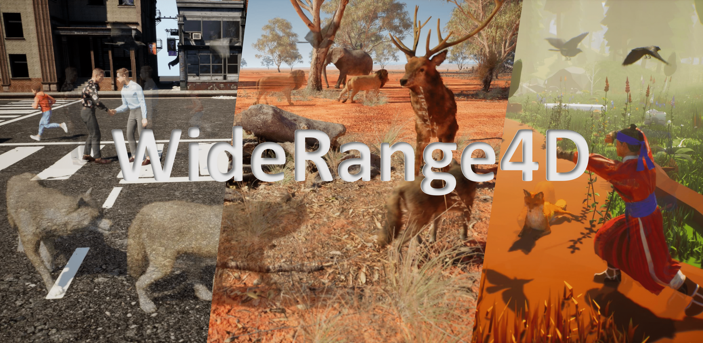

<div align="center">
  
# WideRange4D: Enabling High-Quality 4D Reconstruction with Wide-Range Movements and Scenes


### [Dataset Page](https://huggingface.co/datasets/Gen-Verse/WideRange4D/tree/main) | [arXiv Paper](#)

[Ling Yang](https://yangling0818.github.io)<sup>1*</sup>, [Kaixin Zhu](https://chriszkxxx.github.io)<sup>1*</sup>, [Juanxi Tian](https://tianshijing.github.io)<sup>1*</sup>, [Bohan Zeng](https://scholar.google.com/citations?user=MHo_d3YAAAAJ&hl=en)<sup>1*</sup>, [Mingbao Lin](http://lmb.bjbxit.cn/)<sup>2</sup>, [Hongjuan Pei](https://openreview.net/profile?id=~Hongjuan_Pei1)<sup>3</sup>, [Wentao Zhang](https://zwt233.github.io)<sup>1</sup>, [Shuicheng Yan](http://yanshuicheng.info)<sup>4‡</sup>

<sup>1</sup> Peking University &emsp; <sup>2</sup> Kunlun Skywork AI &emsp; <sup>3</sup> University of the Chinese Academy of Sciences &emsp; <sup>4</sup> National University of Singapore

<sup>*</sup> Equal Contributions. <sup>‡</sup> Corresponding Author.

</div>

## Environmental Setups

Please follow the [3D-GS](https://github.com/graphdeco-inria/gaussian-splatting) to install the relative packages.

```bash
git clone https://github.com/Gen-Verse/WideRange4D
cd WideRange4D
git submodule update --init --recursive
conda create -n WideRange4D python=3.7 
conda activate WideRange4D

pip install -r requirements.txt
pip install -e submodules/depth-diff-gaussian-rasterization
pip install -e submodules/simple-knn
```

In our environment, we use pytorch=1.13.1+cu116.

## Data Preparation

**For synthetic scenes:**
The dataset provided in [D-NeRF](https://github.com/albertpumarola/D-NeRF) is used. You can download the dataset from [dropbox](https://www.dropbox.com/s/0bf6fl0ye2vz3vr/data.zip?dl=0).

**For real dynamic scenes:**
The dataset provided in [HyperNeRF](https://github.com/google/hypernerf) is used. You can download scenes from [Hypernerf Dataset](https://github.com/google/hypernerf/releases/tag/v0.1) and organize them as [Nerfies](https://github.com/google/nerfies#datasets). 

Meanwhile, [Plenoptic Dataset](https://github.com/facebookresearch/Neural_3D_Video) could be downloaded from their official websites. To save the memory, you should extract the frames of each video and then organize your dataset as follows.

```
├── data
│   | dnerf 
│     ├── mutant
│     ├── standup 
│     ├── ...
│   | hypernerf
│     ├── interp
│     ├── misc
│     ├── virg
│   | dynerf
│     ├── cook_spinach
│       ├── cam00
│           ├── images
│               ├── 0000.png
│               ├── 0001.png
│               ├── 0002.png
│               ├── ...
│       ├── cam01
│           ├── images
│               ├── 0000.png
│               ├── 0001.png
│               ├── ...
│     ├── cut_roasted_beef
|     ├── ...
```

**For multipleviews scenes:**
If you want to train WideRange4D or your own dataset of multipleviews scenes, you can orginize your dataset as follows:

```
├── data
|   | multipleview
│     | (Our datasets name) 
│   	  | cam01
|     		  ├── frame_00001.jpg
│     		  ├── frame_00002.jpg
│     		  ├── ...
│   	  | cam02
│     		  ├── frame_00001.jpg
│     		  ├── frame_00002.jpg
│     		  ├── ...
│   	  | ...
```
After that, you can use the  `multipleviewprogress.sh` we provided to generate related data of poses and pointcloud.You can use it as follows:
```bash
bash multipleviewprogress.sh (youe dataset name)
```
You need to ensure that the data folder is organized as follows after running multipleviewprogress.sh:
```
├── data
|   | multipleview
│     | (Our dataset name) 
│   	  | cam01
|     		  ├── frame_00001.jpg
│     		  ├── frame_00002.jpg
│     		  ├── ...
│   	  | cam02
│     		  ├── frame_00001.jpg
│     		  ├── frame_00002.jpg
│     		  ├── ...
│   	  | ...
│   	  | sparse_
│     		  ├── cameras.bin
│     		  ├── images.bin
│     		  ├── ...
│   	  | points3D_multipleview.ply
│   	  | poses_bounds_multipleview.npy
```


## Training

For training synthetic scenes such as `bouncingballs`, run

```
python train.py -s data/dnerf/bouncingballs --port 6017 --expname "dnerf/bouncingballs" --configs arguments/dnerf/bouncingballs.py 
```

For training dynerf scenes such as `cut_roasted_beef`, run
```python
# First, extract the frames of each video.
python scripts/preprocess_dynerf.py --datadir data/dynerf/cut_roasted_beef
# Second, generate point clouds from input data.
bash colmap.sh data/dynerf/cut_roasted_beef llff
# Third, downsample the point clouds generated in the second step.
python scripts/downsample_point.py data/dynerf/cut_roasted_beef/colmap/dense/workspace/fused.ply data/dynerf/cut_roasted_beef/points3D_downsample2.ply
# Finally, train.
python train.py -s data/dynerf/cut_roasted_beef --port 6017 --expname "dynerf/cut_roasted_beef" --configs arguments/dynerf/cut_roasted_beef.py 
```
For training hypernerf scenes such as `virg/broom`: Pregenerated point clouds by COLMAP are provided [here](https://drive.google.com/file/d/1fUHiSgimVjVQZ2OOzTFtz02E9EqCoWr5/view). Just download them and put them in to correspond folder, and you can skip the former two steps. Also, you can run the commands directly.

```python
# First, computing dense point clouds by COLMAP
bash colmap.sh data/hypernerf/virg/broom2 hypernerf
# Second, downsample the point clouds generated in the first step. 
python scripts/downsample_point.py data/hypernerf/virg/broom2/colmap/dense/workspace/fused.ply data/hypernerf/virg/broom2/points3D_downsample2.ply
# Finally, train.
python train.py -s  data/hypernerf/virg/broom2/ --port 6017 --expname "hypernerf/broom2" --configs arguments/hypernerf/broom2.py 
```

For training multipleviews scenes,you are supposed to build a configuration file named (you dataset name).py under "./arguments/mutipleview",after that,run
```python
python train.py -s  data/multipleview/(our dataset name) --port 6017 --expname "multipleview/(our dataset name)" --configs arguments/multipleview/(our dataset name).py 
```


For your custom datasets, install nerfstudio and follow their [COLMAP](https://colmap.github.io/) pipeline. You should install COLMAP at first, then:

```python
pip install nerfstudio
# computing camera poses by colmap pipeline
ns-process-data images --data data/your-data --output-dir data/your-ns-data
cp -r data/your-ns-data/images data/your-ns-data/colmap/images
python train.py -s data/your-ns-data/colmap --port 6017 --expname "custom" --configs arguments/hypernerf/default.py 
```
You can customize your training config through the config files.

## Checkpoint

Also, you can train your model with checkpoint.

```python
python train.py -s data/dnerf/bouncingballs --port 6017 --expname "dnerf/bouncingballs" --configs arguments/dnerf/bouncingballs.py --checkpoint_iterations 200 # change it.
```

Then load checkpoint with:

```python
python train.py -s data/dnerf/bouncingballs --port 6017 --expname "dnerf/bouncingballs" --configs arguments/dnerf/bouncingballs.py --start_checkpoint "output/dnerf/bouncingballs/chkpnt_coarse_200.pth"
# finestage: --start_checkpoint "output/dnerf/bouncingballs/chkpnt_fine_200.pth"
```

## Rendering

Run the following script to render the images.

```
python render.py --model_path "output/dnerf/bouncingballs/"  --skip_train --configs arguments/dnerf/bouncingballs.py 
```

## Evaluation

You can just run the following script to evaluate the model.

```
python metrics.py --model_path "output/dnerf/bouncingballs/" 
```

## Scripts
There are some helpful scripts, please feel free to use them.

`colmap.sh`:
generate point clouds from input data

```bash
bash colmap.sh data/hypernerf/virg/vrig-chicken hypernerf 
bash colmap.sh data/dynerf/sear_steak llff
```

`downsample_point.py` :downsample generated point clouds by sfm.

```python
python scripts/downsample_point.py data/dynerf/sear_steak/colmap/dense/workspace/fused.ply data/dynerf/sear_steak/points3D_downsample2.ply
```

Thanks 4DGaussians, We always use `colmap.sh` to generate dense point clouds and downsample it to less than 40000 points.


## Contributions

**Please feel free to raise issues or submit pull requests to contribute to our codebase.**

## Acknowledgement

Some source code of ours is borrowed from [4DGaussians](https://github.com/hustvl/4DGaussians). We sincerely appreciate the excellent work of these authors.

## Citation
```
@article{yang2025widerange4d,
  title={WideRange4D: Enabling High-Quality 4D Reconstruction with Wide-Range Movements and Scenes},
  author={Yang, Ling and Zhu, Kaixin and Tian, Juanxi and Zeng, Bohan and Lin, Mingbao and Pei, Hongjuan and Zhang, Wentao and Yan, Shuichen},
  journal={arXiv preprint arXiv:},
  year={2025}
}
```

